<!-- Banner -->
<p align="center">
  
</p>

<!-- Typing animation (cor muda conforme o tema claro/escuro do GitHub) -->
<p align="center">
  <picture>
    <source media="(prefers-color-scheme: dark)" srcset="https://readme-typing-svg.demolab.com?font=JetBrains+Mono&weight=500&size=20&duration=3000&pause=1200&color=D4A373&center=true&vCenter=true&width=640&height=44&lines=Dev+Full+Stack+%C2%B7+Software+Engineer;Da+interface+ao+banco+de+dados;HTML+%C2%B7+CSS+%C2%B7+JavaScript+%C2%B7+React;Next.js+%2B+PostgreSQL">
    
  </picture>
</p>

<br>

### `01` &nbsp;Sobre mim

Sou **David Halan**, Dev Full Stack e Software Engineer. Trabalho nas duas pontas da aplicação: da interface no navegador ao banco de dados.

```js
const david = {
  nome: "David Halan de Sousa Tavares Aragão",
  papel: ["Dev Full Stack", "Software Engineer"],
  interface: ["HTML", "CSS", "JavaScript", "React"],
  aplicacao: ["Next.js"],
  dados: ["PostgreSQL"],
};
```

<br>

### `02` &nbsp;Tecnologias

<p align="center">
  
  
  
  
  
  
</p>

<br>

### `03` &nbsp;Projetos

<!-- Os cards abaixo são gerados a partir de projects.json pelo workflow "Atualizar perfil". Edite o JSON, não este bloco. -->
<!-- PROJETOS:INICIO -->
<p align="center">
  <a href="https://github.com/DavidHalan"></a>
  <a href="https://github.com/DavidHalan"></a>
  <a href="https://github.com/DavidHalan"></a>
  <a href="https://github.com/DavidHalan"></a>
</p>
<!-- PROJETOS:FIM -->

<br>

### `04` &nbsp;GitHub em números

<!-- Todos os cards desta seção são gerados diariamente por GitHub Actions (.github/workflows/profile.yml) -->
<p align="center">
  
  
</p>
<p align="center">
  
</p>
<p align="center">
  
</p>
<p align="center">
  
</p>

<br>

### `05` &nbsp;Contribuições

<p align="center">
  <picture>
    <source media="(prefers-color-scheme: dark)" srcset="https://raw.githubusercontent.com/DavidHalan/DavidHalan/main/profile/snake-dark.svg">
    <source media="(prefers-color-scheme: light)" srcset="https://raw.githubusercontent.com/DavidHalan/DavidHalan/main/profile/snake.svg">
    
  </picture>
</p>

<br>

### `06` &nbsp;Redes sociais

<p>
  <a href="https://www.linkedin.com/in/david-halan-dev"></a>
  <a href="https://www.instagram.com/david_halan.dev/"></a>
</p>

<br>

<!-- Rodapé -->
<p align="center">
  
</p>
